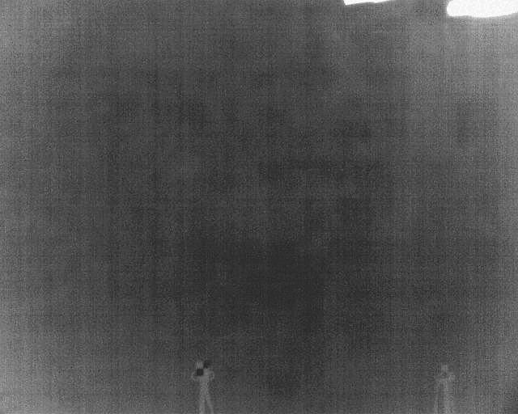
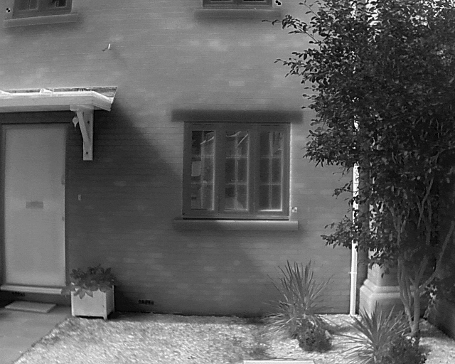

# THERMITAGE: A Curated Data Repository of Multi-Modal, Multi-Temporal and Multi-Sensor Thermal Images

**Thermitage** is a research-oriented data repository dedicated to advancing the integration of InfraRed Thermography (IRT) within photogrammetric data fusion. The ambition for Thermitage, sharing an initial collection of datasets generated specifically for InfraRed Thermography 3D-Data Fusion (IRT-3DDF), is to provide a collaborative repository to advance data fusion methods focussed on the significance of historic buildings. In addition, this repository will provide benchmarking for the development of future machine- and deep learning tools tailored to cultural heritage applications.

  
  
  
  

## 🔍 Core Objectives:

- **IRT & Photogrammetry Data Fusion:**  
  Advance the field of IRT-3DDF by providing all the necessary data and documentation for method development and value extraction.

- **IRT for Deep Learning Benchmarking:**  
  Provide datasets for learning-based segmentation, defect detection, and temporal analyses.

- **Cultural Heritage Focus:**  
  Enhance the principles and practices of IRT-3DDF for non-destructive testing (NDT)techniques within cultural and architectural heritage.

## 🛠 Features:

- 🖼 **IRT Datasets:** A collection of InfraRed Thermography datasets across sensors, cameras and platforms. This includes: (1) tandem sensors featured within the same thermal camera housing, thermal cameras of varying resolution, IR wavelengths and sensitivity; (2) complementary datasets coming from additional digital cameras, device screenshots or  advanced file formats; and (3) IRT coming from terrestrial (independent cameras or stereo set-ups) and aerial (UAV or fixed-wing aircraft) devices.

- 🧠 **IRT Benchmarking:** A comprehsnive collection of thermal infrared (TIR) images denoted for training \& validation of machine- and deep-learning models. 

- 📐 **IRT Processing Tools:** A collection of scripts and utilities for pre- and post-processing TIR images. This includes: (1) scripts designed to aid geometric and radiometric analysis of TIR images; (2) camera-specific scripts designed to work with specific functions and protocols; (3) a space for the development of additional tools through community-led projects.  

## 📦 Structure:

- **/data** → Sample IRT datasets separated by location, modalties and processes. 
- **/docs** → Documentation for IRT imaging survey best practice, data sharing and re-use policies.
- **/utils** → Scripts, notebooks and documentation for IRT data pre-processing, analysis and visualisation.

## 📄 Citations:

If you use Thermitage, please cite:  

* Sutherland, N.; Morelli, L.; Mills, J.; Bryan, P.; Marsh, S.; Remondino, F. Multi-Modal and Multi-Sensor Photogrammetric Data Fusion Exploiting a New Repository for Infrared Thermography Datasets. *Int. Arch. Photogramm. Remote Sens. Spatial Inf. Sci.* 2025, XLVIII-1/W6-2025, pp. 235–242. [https://doi.org/10.5194/isprs-archives-XLVIII-1-W6-2025-235-2025](https://doi.org/10.5194/isprs-archives-XLVIII-1-W6-2025-235-2025)

* Sutherland, N.; Marsh, S.; Remondino, F.; Perda, G.; Bryan, P.; Mills, J. Geometric Calibration of Thermal Infrared Cameras: A Comparative Analysis for Photogrammetric Data Fusion. *Metrology* 2025, 5, 43. [https://doi.org/10.3390/metrology5030043](https://doi.org/10.3390/metrology5030043)

* Morelli, L.; Sutherland, N.; Ioli, F.; Vitti, A.; Marsh, S.; Mills, J.; Bryan, P.; Remondino, F. Evaluating Deep Learning Local Features for RGB-Thermal Image Matching
and 3D InfraRed Thermography. *Geomatics* 2026, (Pre-Publish)